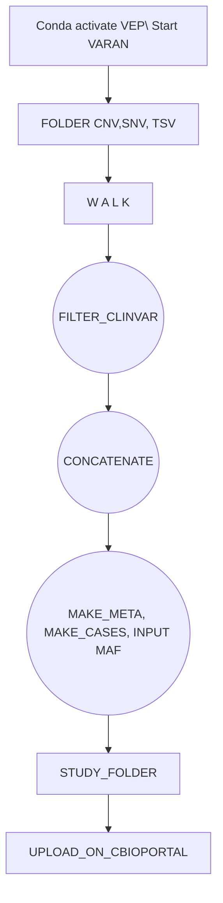
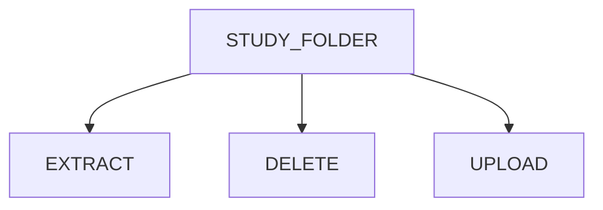

[](https://zenodo.org/doi/10.5281/zenodo.12806060)

# Varan-Release


# VARAN 2.0


## Introduction  

<p align="justify">
Varan 2.0 is a Python-based application that provides a pipeline to automatically prepare cancer genomics data in the specific format supported by the <a href="https://www.cbioportal.org/">cBioPortal</a>.<br>
Specifically, starting with a folder containing the vcf files, or with a single file containing a list of vcf file paths, this application can structure and validate a study folder ready to be uploaded to its local instance of cBioPortal.<br>
This application also gives the possibility to work on existing study folder. In fact, it permits to update a study folder by adding new samples or extract/remove samples from it.<br>
Click <a href="https://github.com/bioinformatics-policlinicogemelli/Varan-Release/blob/main/cBioPortal%20docker%20install.md")>here</a> for more information on the steps for cBioportal installation.
 
## Installation procedure

### Prerequisites
* <b>Variant Effect Predictor (VEP)</b><p align="justify">The Variant Effect Predictor <a href="https://www.ensembl.org/info/docs/tools/vep/index.html">VEP</a> is a tool used to determine the effect of variants (SNPs, insertions, deletions, CNVs or structural variants) on genes, transcripts, and protein sequence, as well as regulatory regions. <br>The steps to install VEP can be found <a href="https://www.ensembl.org/info/docs/tools/vep/script/vep_download.html"> here</a>, while DB and FASTA files can be downloaded <a href="http://www.ensembl.org/info/docs/tools/vep/script/vep_cache.html#cache)"> here</a>

* <b>vcf2maf</b><br><p align="justify"><a href="https://github.com/mskcc/vcf2maf/tree/main">vcf2maf</a> is the tool required for the conversion of vcf files in maf format ones. 
<br>All the installation info can be found <a href="https://github.com/mskcc/vcf2maf/tree/main">here</a>

* <b>Samtools</b> <br><p align="justify"><a href="https://www.htslib.org/">Samtools</a> is a suite of programs for interacting with high-throughput sequencing data. 
<br>All the installation info can be found <a href="https://www.htslib.org/download/">here</a>

### Varan 2.0

To correctly install and use Varan 2.0:
1. Open a terminal
2. Digit the following command to clone the repository folder: 
```
git clone https://github.com/bioinformatics-policlinicogemelli/varan-2.0.git
```
3.  Install all of the packages required
```
cd <varan_folder_path>/varan-2.0
pip install -r requirements.txt
```
<p align="justify">
⚠️ <i>Depending on the python version it may be necessary to use pip3 instead of pip</i><br><br>
To test the installation and check if everything works, launch the main script <b>varan.py</b>: 

```
cd <varan_folder_path>/varan-2.0
python varan.py -h
```
If everything works, you will see a printed output like this:
```
1:04:09.32 | INFO | Welcome to VARAN usage: varan.py [-h] [-c CANCER] [-d] [-i INPUT] [-f] [-t {snv,cnv}] [-w] [-v] [-u] [-n NEWPATH] [-r] [-e] -o OUTPUT_FOLDER [-s SAMPLELIST] [-p PATH]
Argument of Varan script
optional arguments:
-h, --help show this help message and exit
-c CANCER, --Cancer CANCER Cancer Name
-d, --Directory Add this argument if input is a folder
-i INPUT, --input INPUT input folder tsv with data or tsv with path of data
-f, --filter_snv Filter out from the vcf the variants wit dot (.) in Alt column
-t {snv,cnv}, --vcf_type {snv,cnv} Select the vcf file to parse
-w, --overWrite Overwrite output folder if it exists
-v, --vus Filter out VUS variants
-u, --Update Add this argument if you want to concatenate two studies
-n NEWPATH, --NewPath NEWPATH Path of new study folder to add
-r, --Remove Add this argument if you want to remove samples from a study
-e, --Extract Add this argument if you want to extract samples from a study
-o OUTPUT_FOLDER, --output_folder OUTPUT_FOLDER Output folder
-s SAMPLELIST, --SampleList SAMPLELIST Path of file with list of SampleIDs
-p PATH, --Path PATH Path of original study folder
```
<p align="justify">
⚠️ <i>If any error is printed while launching varan.py, check if the step 3 completed without errors</i>

## Usage

<p align="justify">The first step to start using Varan is to correctly set the configuration file *conf.ini*. This file is divided in 6 subsessions:
* <p align="justify">Paths: here is possible to specify Vep, vcf2maf and fasta paths and data.
* <p align="justify">Project: here is possible to specify project info like name, description and profile
* <p align="justify">Filters: here are specified the filters applied in the filtering step
* <p align="justify">Cna: here are specified the CNV genotypes
* <p align="justify">TMB: here are specified the TMB thresholds
* <p align="justify">MSI: here are specified the MSI thresholds

<p align="justify">Varan application can be divided into two separate main blocks that require different inputs and ensure different operations to perform on them. The first block contains the functions to create a new study folder ex-novo, while the second one contains the functions to modify (Update/Extract/Remove samples) an existing study folder.

Here below are reported the steps and the options to set to run each block.

### Block One: Create Study Folder ex-Novo

#### Workflow



#### 1. Preparing Input

<p align="justify">
To create a new study folder, the user must give .vcf files as input to the program.
This can be done in two different ways:


<b>tsv file</b>: user must prepare a tsv file containing all of the vcf files' paths <b>Folder</b>: user must organize a folder containing all of the vcf files and a csv file where the patient IDs and samples IDs are listed. The structure of this folder have to follow the one reported below </li>

```
input_folder/
├── CNV
│   ├── 001.vcf
│   ├── 002.vcf
│   └── 003.vcf
├── SNV
│   ├── 001.vcf
│   ├── 002.vcf
│   └── 003.vcf
├── CombinedOutput
│   ├── 001_CombinedVariantOutput.tsv
│   ├── 002_CombinedVariantOutput.tsv
│   └── 003_CombinedVariantOutput.tsv
└── clinical_info.tsv
```
Where:
* <p align="justify">*CombinedVariantOutput.tsv* is a tsv file that is necessary to TMB, MSI and Fusions evaluation and that has to contain [TMB], [MSI] and [Fusions] fields. It has to be named as *PatientID_CombinedVariantOutput.tsv*

* <p align="justify">*clinical_info.tsv* is a tsv file that is necessary to map tha sample ID to the patient ID. It has to be structured as a two columns tables with "PatientID" and "SampleID" fields.

⚠️ *An example of both input types can be found in the **input_templates** folder*

#### 2. Launch Varan main

These are the options that can be set for this block:

| Options | Description | Type | Required
|-------------------------|----------------| :---:| :---:|
|-o <br> --output_folder| <p align="justify">Add this option to insert the path where to save the output folder| string | Yes
|-i <br> --input| <p align="justify">Add this option to insert the path to the input tsv file where the vcf files are listed|  | No
|-c <br> --cancer| <p align="justify">Add this option to specify a cancer type| string | No
|-f <br> --filter_snv| <p align="justify">Add this option to filter out from the vcf the variants with dot (.) and PASS in Alt and Filter column respectively |boolean| No
|-t <br> --vcf_type|<p align="justify">Add this option to specify the type of vcf (snv/cnv) |string|Only if the -i option is selected
|-w <br> --overWrite| <p align="justify">Add this option to overwrite output folder if already exists (⚠️ *if not set, the program will stop if it finds an existing output directory*)|boolean| No
|-v <br> --vus| <p align="justify">Add this option to filter out VUS variants | boolean | No

**Example:**

<ins>vcf file input - SNV </ins>: Launch this command to perform a filtering on vcf files, a filter on VUS variants and save (or rewrite) a study folder starting from a file listing snv vcf files.
```
python varan.py -i <path_to_vfc_tsv_file> -c <cancer_name> -t snv -f -v -o <path_to_output_folder> -w
```
<ins>vcf file input - CNV </ins>: Launch this command to perform a filtering on vcf files, a filter on VUS variants and save (or rewrite) a study folder starting from a file listing cnv vcf files.
```
python varan.py -i <path_to_vfc_tsv_file> -c <cancer_name> -t cnv -f -v -o <path_to_output_folder> -w
```
<ins>vcf directory </ins>: Launch this command to perform a filtering on vcf files, a filter on VUS variants and save (or rewrite) a study folder starting from a directory containing all of the vcf files.
```
python varan.py -d <path_to_vfc_folder> -c <cancer_name> -f -v -o <path_to_output_folder> -w
```

#### 3. Output

After varan.py has run successfully, the resulted output folder should have the following organization and content:
```
cancer_name
├── data_clinical_sample.xlsx
├── case_lists
│   ├── cases_cna.txt
│   ├── cases_sequenced.txt
│   └── cases_sv.txt
├── data_clinical_patient.txt
├── data_clinical_sample.txt
├── data_cna.txt
├── data_cna_hg19.seg
├── data_mutations_extended.txt
├── data_sv.txt
├── meta_clinical_patient.txt
├── meta_clinical_sample.txt
├── meta_cna.txt
├── meta_cna_hg19_seg.txt
├── meta_mutations_extended.txt
├── meta_study.txt
└── meta_sv.txt
```
<p align="justify">
When updating/removing/extracting samples, a new study folder will be created within the output_folder with the name <i>updated_data</i> in which the modified files will be stored. 

### Block Two: Modify Existing Study Folder
#### Workflow

#### 1. Preparing Input

<p align="justify">The input for this block is a study folder correctly populated. It can be the output of the first block or an already existing folder. Its structure has to follow the one reported in the output paragraph. 

#### 2. Launch Varan main

These are the options that can be set for this block:

| Options | Input | Type | Required
|----------------|----------------| :---:| :---:|
|-o <br> --output_folder| <p align="justify">Add this option to insert the path where to save the output folder| string | Yes
|-u <br> --Update| <p align="justify">Add this option if you want to update an existing study folder| boolean | No
|-r <br> --Remove| <p align="justify">Add this option if you want to remove samples from an existing study folder| boolean | No
|-e <br> --Extract| <p align="justify">Add this option if you want to extract samples from an existing study folder| boolean | No
|-n <br> --NewPath| <p align="justify">Add this option to insert the path where to save the updated study folder | string | Only if the -u option is selected
|-s <br> --SampleList| <p align="justify">Add this option to insert the path to the txt file containing the list of samples to remove/extract from an existing study folder| string | Only if the -r or -e option is selected
|-p <br> --Path| <p align="justify">Add this option to insert the path to the already existing study folder to update or from where remove/extract samples | string | Only if the -u, -r or -e option is selected


**Example:**

<p align="justify">
<ins>sample update</ins>: Launch this command to update a study folder by inserting or updating clinical and samples info and to save a new updated one in the output path.

```
python varan.py -u -p <path_to_old_study_folder> -n <path_to_new_study_folder> -o <path_to_output_folder>
```
<p align="justify">
<ins>sample removal</ins>: Launch this command to remove a list of samples from a study folder and to save a new one without the removed samples in the output path.

```
python varan.py -r -p <path_to_study_folder> -s <path_to_sample_list_file> -o <path_to_output_folder>
```
<p align="justify">
<ins>sample extraction</ins>: Launch this command to extract a list of samples from a study folder and to save a new one containing the extracted samples only in the output path.

```
python varan.py -e -p <path_to_study_folder> -s <path_to_sample_list_file> -o <path_to_output_folder>
```
#### 3. Output

<p align="justify">
After varan.py has run successfully, the resulted output folder <i>updated_data</i> will be created and will contain the modified files.  The folder organization will be the same as the one reported in the ouput paragraph of the block one.  
